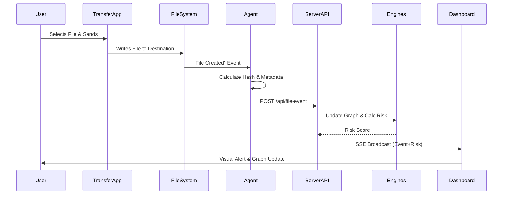
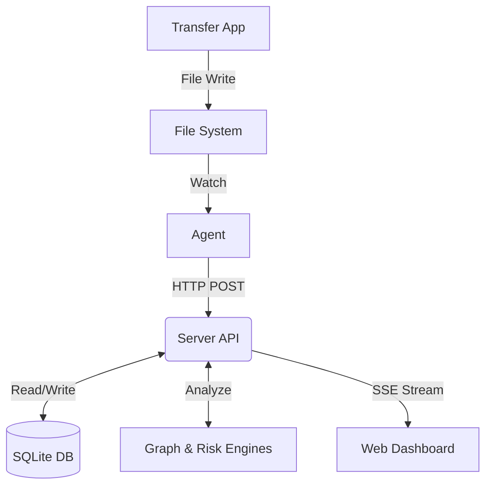

# System Flow Diagrams

## Event Processing Flow

```mermaid
sequenceDiagram
    participant User
    participant TransferApp
    participant FileSystem
    participant Agent
    participant ServerAPI
    participant Engines
    participant Dashboard

    User->>TransferApp: Selects File & Sends
    TransferApp->>FileSystem: Writes File to Destination
    FileSystem->>Agent: "File Created" Event
    Agent->>Agent: Calculate Hash & Metadata
    Agent->>ServerAPI: POST /api/file-event
    ServerAPI->>Engines: Update Graph & Calc Risk
    Engines-->>ServerAPI: Risk Score
    ServerAPI->>Dashboard: SSE Broadcast (Event+Risk)
    Dashboard->>User: Visual Alert & Graph Update
```

## Component Interaction

```mermaid
graph TD
    A[Agent] -->|HTTP POST| B(Server API)
    C[Transfer App] -->|File Write| D[File System]
    D -->|Watch| A
    B <-->|Read/Write| E[(SQLite DB)]
    B <-->|Analyze| F[Graph & Risk Engines]
    B -->|SSE Stream| G[Web Dashboard]
```
