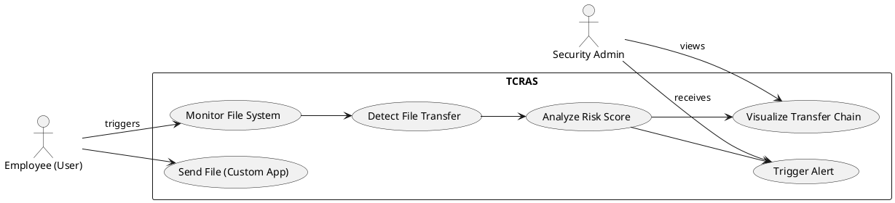
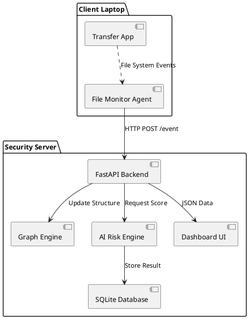
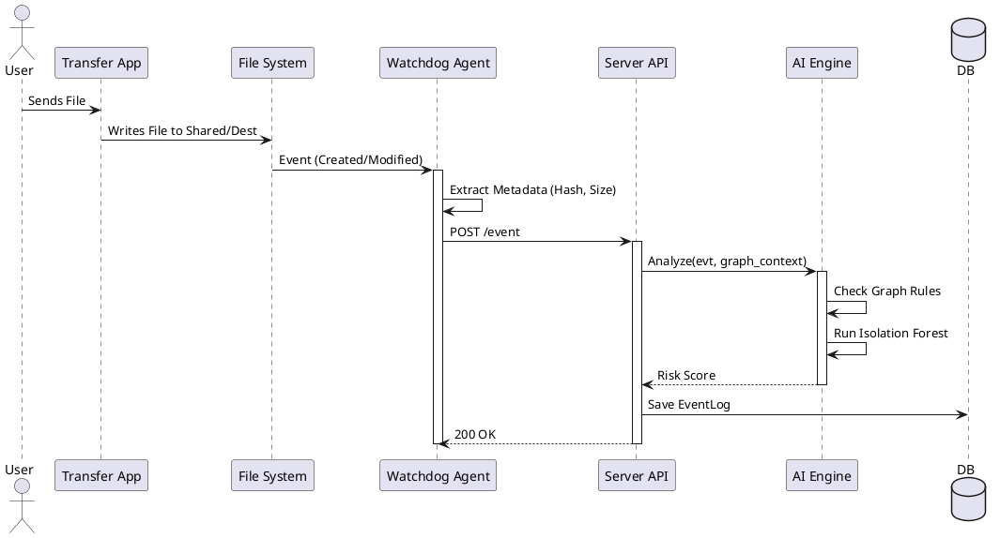
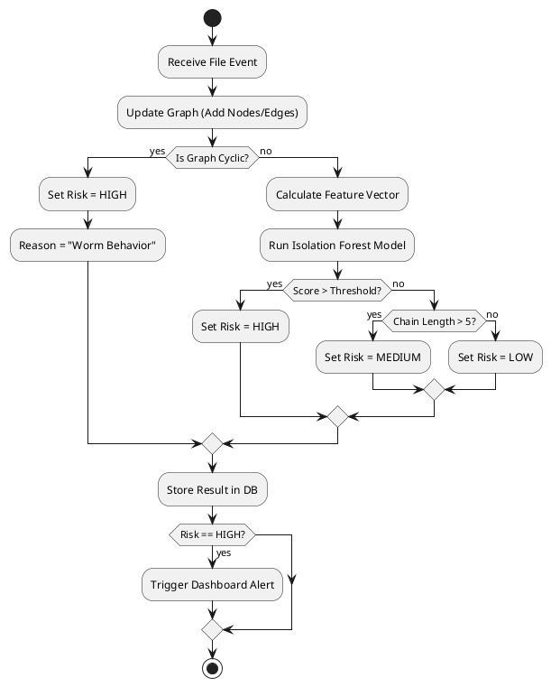

# TCRAS UML Diagrams

## 1. Use Case Diagram

```plantuml
@startuml
left to right direction
actor "Security Admin" as Admin
actor "Employee (User)" as User

rectangle TCRAS {
  usecase "Monitor File System" as UC1
  usecase "Detect File Transfer" as UC2
  usecase "Analyze Risk Score" as UC3
  usecase "Visualize Transfer Chain" as UC4
  usecase "Trigger Alert" as UC5
  usecase "Send File (Custom App)" as UC6
}

User --> UC6
User --> UC1 : triggers
UC1 --> UC2
UC2 --> UC3
UC3 --> UC4
UC3 --> UC5
Admin --> UC4 : views
Admin --> UC5 : receives
@enduml
```

## 2. Component Diagram

```plantuml
@startuml
package "Client Laptop" {
  [File Monitor Agent] as Agent
  [Transfer App] as App
}

package "Security Server" {
  [FastAPI Backend] as API
  [Graph Engine] as Graph
  [AI Risk Engine] as AI
  [SQLite Database] as DB
  [Dashboard UI] as UI
}

Agent --> API : HTTP POST /event
App ..> Agent : File System Events
API --> Graph : Update Structure
API --> AI : Request Score
AI --> DB : Store Result
API --> UI : JSON Data
@enduml
```

## 3. Sequence Diagram (File Transfer Flow)

```plantuml
@startuml
actor User
participant "Transfer App" as App
participant "File System" as FS
participant "Watchdog Agent" as Agent
participant "Server API" as API
participant "AI Engine" as AI
database DB

User -> App: Sends File
App -> FS: Writes File to Shared/Dest
FS -> Agent: Event (Created/Modified)
activate Agent
Agent -> Agent: Extract Metadata (Hash, Size)
Agent -> API: POST /event
activate API
API -> AI: Analyze(evt, graph_context)
activate AI
AI -> AI: Check Graph Rules
AI -> AI: Run Isolation Forest
AI --> API: Risk Score
deactivate AI
API -> DB: Save EventLog
API --> Agent: 200 OK
deactivate API
deactivate Agent
@enduml
```

## 4. Activity Diagram (Risk Analysis)

```plantuml
@startuml
start
:Receive File Event;
:Update Graph (Add Nodes/Edges);
if (Is Graph Cyclic?) then (yes)
  :Set Risk = HIGH;
  :Reason = "Worm Behavior";
else (no)
  :Calculate Feature Vector;
  :Run Isolation Forest Model;
  if (Score > Threshold?) then (yes)
    :Set Risk = HIGH;
  else (no)
    if (Chain Length > 5?) then (yes)
      :Set Risk = MEDIUM;
    else (no)
      :Set Risk = LOW;
    endif
  endif
endif
:Store Result in DB;
if (Risk == HIGH?) then (yes)
  :Trigger Dashboard Alert;
endif
stop
@enduml
```
